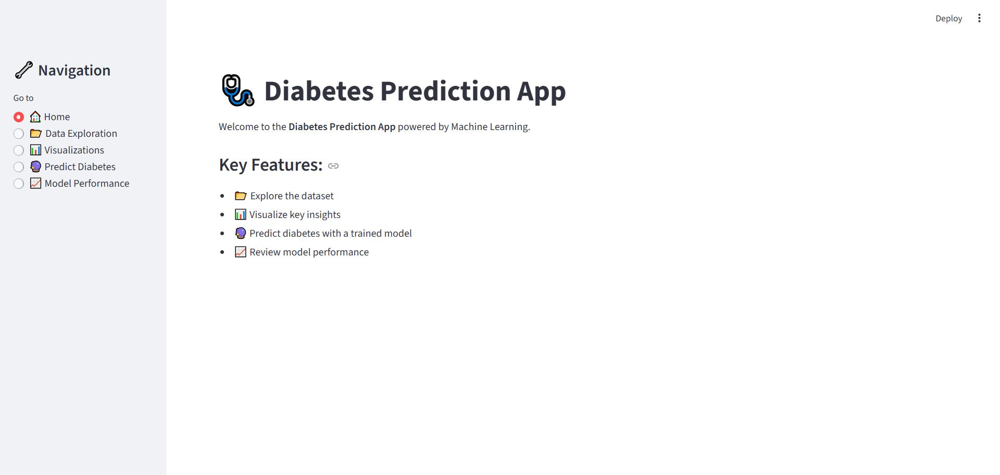

# 🩺 Diabetes Prediction App
A machine learning based application built with **Streamlit** that predicts whether a patient is likely to have diabetes based on key medical parameters. The model is trained on the **Pima Indians Diabetes Dataset**

## 📌 Features
- 📊 **Data Exploration**: View dataset structure, missing values, and filter by glucose level  
- 📈 **Interactive Visualizations**: Histogram, Pie Chart, and Correlation Heatmap  
- 🔮 **Prediction Page**: Input patient details and get real-time prediction  
- 📉 **Model Performance**: View classification report, confusion matrix, and compare models  
- 🌐 **Deployed on Streamlit Cloud**

## 🔍 Model Details

The model used is a **Support Vector Machine (SVM)** trained on the following features:

- Pregnancies
- Glucose
- BloodPressure
- SkinThickness
- Insulin
- BMI
- DiabetesPedigreeFunction
- Age

Performance metrics are included in the **Model Performance** section of the app.

## 🌐 Deployment

The app is deployed on **Streamlit Cloud**.  
You can access the live version here: 
👉 https://diabetespredictionappgit.streamlit.app/
